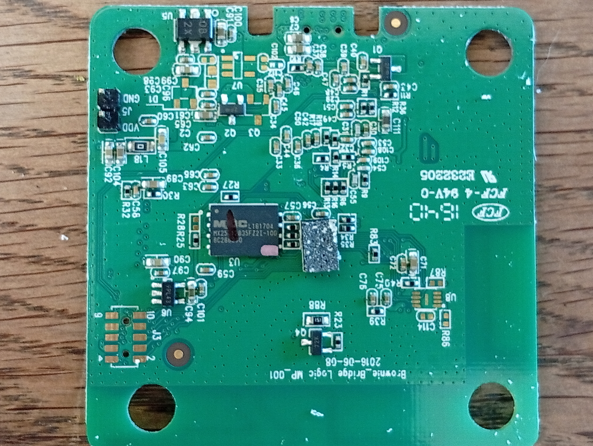
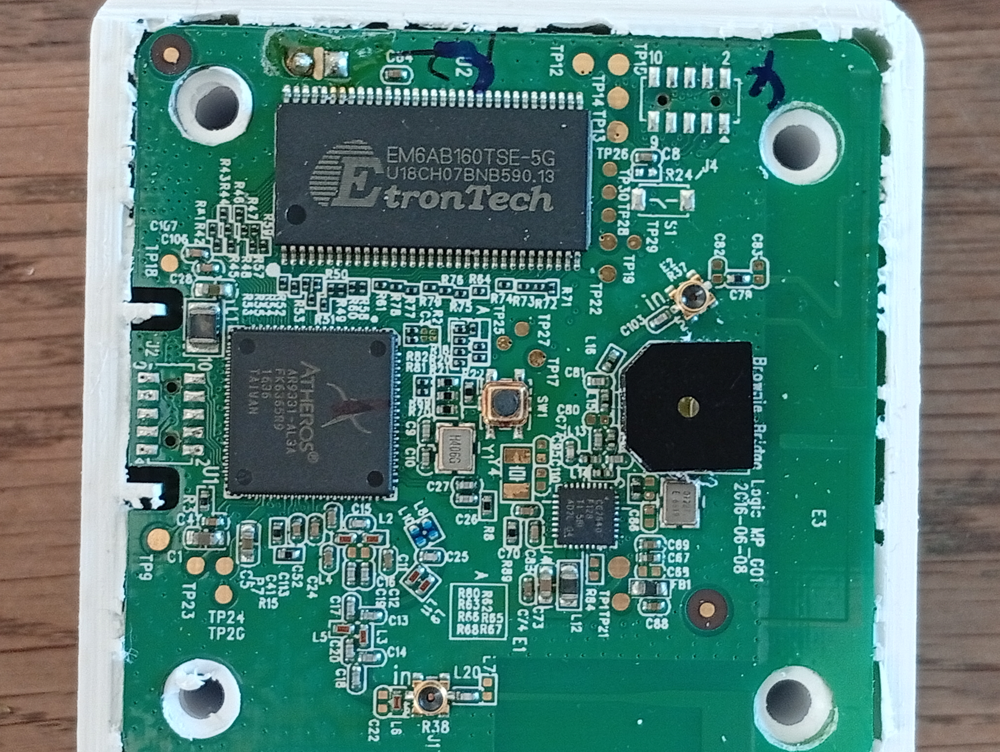
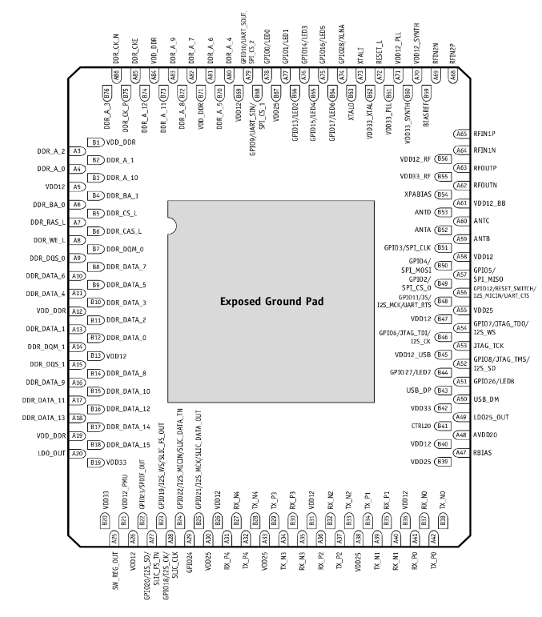
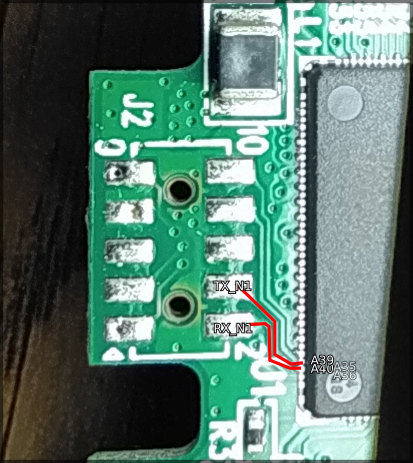
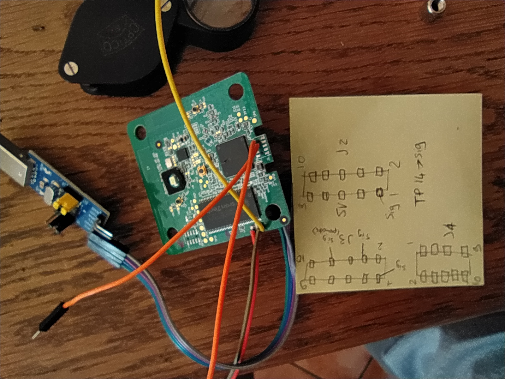

# LogiSwitch STATION

Notes about reversing Logi73ch POP Button so we can still use it after it dies.

## Exploration

using HCI RTL8761BUV dongle

### BLE exploration

## Materiel

##### Composants

- **CC2640**
  - CC2640 SimpleLink™ Bluetooth® Smart Wireless MCU
- **MX2512835FZ** 
  - CMOS MXSMIO® (SERIAL MULTI I/O)
    FLASH MEMORY
- **EM6AB160TSE**
  - 32M x 16 bit DDR Synchronous DRAM (SDRAM)
- **AR9331 AL 3 A**
  - AR9331 Highly-Integrated and Cost Effective IEEE 802.11n
    1x1 2.4 GHz SoC for AP and Router Platforms
    - Complete IEEE 802.11n 1x1 AP or router in a
      single chip
    - MIPS 24K processor operating at up to
      400 MHz
    - External 16-bit DDR1, DDR2, or SDRAM
      memory interface
    - SPI NOR Flash memory support
    - No external EEPROM needed
    - 4 LAN ports and 1 WAN port IEEE 802.3 Fast
      Ethernet switch with auto-crossover, auto
      polarity, and auto-negotiation in PHYs
    - Four classes of QoS per port
    - Fully integrated RF front-end including PA
      and LNA
    - Optional external LNA/PA
    - Switched antenna diversity
    - High-speed UART for console support
    - I 2
      S/SPDIF-out audio interface
    - SLIC for VOIP/PCM
    - USB 2.0 host/device mode support
    - GPIO/LED support
    - JTAG-based processor debugging supported
    - 25 MHz or 40 MHz reference clock input
    - Advanced power management with dynamic
      clock switching for ultra-low power modes
    - 148-pin, 12 mm x 12 mm dual-row LPCC
      package

##### Alimentation

Alimenté par un circuit relié via un dupont à une carte d'alim 220v->

## Pictures of the main board

## Searching for access

I really want to try to find an UART so i can play. Here's the IC Pinout:

Looking at the board, i think TX_N1 and RX_N1 are routed to the port J2:

Not sure about this, Nosignal on PAD 2 and 4 as expected, but some serial looking stuff on 1. Maybe 1 is TX.

